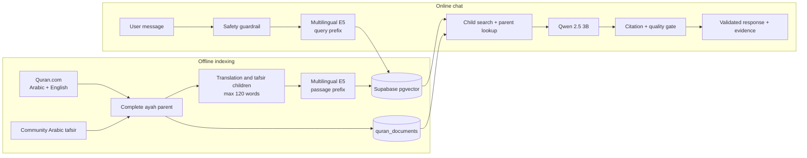

# Qalbu

Qalbu adalah prototipe **grounded Quran reflection RAG**: pengguna bercerita dengan bahasa sehari-hari, sistem mencari ayat yang relevan, lalu menyusun refleksi singkat yang wajib terikat pada ayat, terjemahan, dan tafsir yang benar-benar ditemukan.

> **Status: eksperimental, belum siap produksi.** Qalbu bukan layanan kesehatan mental, bukan terapi, bukan mesin fatwa, dan bukan pengganti ulama, psikolog, dokter, atau layanan darurat.

## Yang sudah bekerja

- FastAPI + antarmuka chat responsif yang disajikan dari server yang sama.
- Parent-child RAG: child kecil dicari dengan vector search, parent ayat lengkap diambil sebagai bukti.
- Embedding lokal `intfloat/multilingual-e5-base` dengan prefix E5 dan vector 768 dimensi.
- Supabase Postgres + pgvector + HNSW untuk penyimpanan dan pencarian.
- Ollama lokal dengan `qwen2.5:3b-instruct`, disetel untuk laptop CPU/RAM 8 GB.
- Hybrid retrieval: semantic search ditambah intent terkurasi untuk kasus refleksi yang telah direview.
- Quality gate setelah generasi: relevansi konteks, dukungan tafsir, panjang, kutipan, dan sitasi diperiksa sebelum jawaban tampil.
- Arabic asli, terjemahan Inggris beratribusi, tafsir yang tersedia, serta provenance dikirim sebagai evidence kanonis—bukan teks buatan model.
- Safety guardrail dijalankan sebelum retrieval/LLM; indikasi bahaya segera melewati jalur krisis.
- Cache query embedding, output LLM, dan respons RAG di memori proses.
- Test API, retrieval, sitasi, guardrail, Ollama adapter, dan kualitas respons.

## Arsitektur ringkas



Alur lengkap ada di [docs/SYSTEM_WORKFLOW.md](docs/SYSTEM_WORKFLOW.md). Keputusan teknis dan failure path ada di [docs/RAG_ARCHITECTURE.md](docs/RAG_ARCHITECTURE.md).

## Sumber data aktif

| Layer | Sumber | Status |
| --- | --- | --- |
| Arabic Quran | Quran.com Uthmani | 6.236 ayat / 114 surah pada snapshot lokal |
| English translation | Saheeh International via Quran.com | Alternatif sementara, bukan terjemahan Indonesia |
| Indonesian translation | Belum tersedia dari sumber terverifikasi | Tidak dibuat atau dilabeli sebagai Kemenag |
| Arabic tafsir | Dataset komunitas Kaggle | Lokal: 103/114 surah; tidak lengkap dan bukan Kemenag |

Corpus eksternal tidak masuk Git. Cara mengambil data ada di [data/README.md](data/README.md); attribution dan risiko redistribusi ada di [THIRD_PARTY_NOTICES.md](THIRD_PARTY_NOTICES.md).

## Prasyarat

- Windows 10/11 atau Linux/macOS
- Python 3.11+ (pengembangan saat ini memakai Python 3.12)
- [Ollama](https://ollama.com/) dengan model `qwen2.5:3b-instruct`
- Project Supabase dengan Postgres + pgvector
- Sekitar 8 GB RAM untuk profil lokal; tutup aplikasi berat saat embedding pertama
- Docker Desktop hanya bila memakai workflow Docker development

## Quick start — native Windows

```powershell
python -m venv .venv
.\.venv\Scripts\Activate.ps1
python -m pip install -r requirements.txt
Copy-Item .env.example .env
ollama pull qwen2.5:3b-instruct
```

Isi `.env`. Untuk proses Python yang berjalan langsung di Windows, ubah URL Ollama:

```env
LLM_PROVIDER=ollama
OLLAMA_BASE_URL=http://127.0.0.1:11434
OLLAMA_MODEL=qwen2.5:3b-instruct
SUPABASE_URL=https://PROJECT_REF.supabase.co
SUPABASE_SECRET_KEY=YOUR_SERVER_SIDE_SECRET
```

Jalankan aplikasi:

```powershell
python -m uvicorn app.main:app --reload --host 127.0.0.1 --port 8000
```

Buka <http://127.0.0.1:8000>. Jangan buka `frontend/index.html` melalui `file://` atau Live Server karena UI memanggil API relatif pada origin FastAPI.

## Supabase dan indexing

1. Terapkan file SQL di `supabase/migrations/` sesuai urutan nama file.
2. Unduh/generate corpus lokal.
3. Upsert parent, buat child, embed child, lalu rekonsiliasi.

```powershell
python scripts/fetch_quran_com.py
python scripts/seed.py
python scripts/chunk.py
python scripts/embed.py
python scripts/reconcile_chunks.py
```

`seed.py` membuat satu ayat lengkap sebagai parent. `chunk.py` membuat child dari translation/tafsir dengan panjang maksimal 120 kata. `embed.py` resumable dan memakai fingerprint source+model; child yang masih identik dilewati. `reconcile_chunks.py` baru menghapus child lama setelah semua child aktif terbukti sudah ter-embed.

Jangan menjalankan `scripts/prune_legacy_corpus.py` sebagai quick start. Script itu menghapus data lama dan hanya untuk maintenance setelah verifikasi penuh.

## Docker development

`.env.example` memakai `OLLAMA_BASE_URL=http://host.docker.internal:11434`, yaitu alamat container menuju Ollama di host Windows.

```powershell
docker compose up --build
docker compose down
```

Compose memakai bind mount dan Uvicorn `--reload`; ini konfigurasi development, bukan deployment produksi.

## API

| Endpoint | Fungsi |
| --- | --- |
| `POST /api/v1/chat` | Chat utama melalui Server-Sent Events |
| `POST /api/chat` | Respons JSON kompatibilitas lama |
| `GET /api/v1/health` | Status proses + apakah konfigurasi RAG tersedia |
| `GET /api/v1/ready` | Gate konfigurasi dan kontak krisis terverifikasi |
| `GET /api/v1/sources` | Provenance/kelengkapan corpus lokal |
| `GET /api/v1/eval/report` | Artifact evaluasi terbaru bila ada |
| `GET /api/v1/config/public` | Konfigurasi runtime yang aman dipublikasikan |
| `GET /api/themes` | Vocabulary tema refleksi yang disetujui |

Contoh SSE:

```powershell
curl.exe -N -X POST http://127.0.0.1:8000/api/v1/chat `
  -H "Content-Type: application/json" `
  -d '{"message":"Aku merasa hampa","lang":"id","tone":"lembut","max_tokens":72}'
```

Kontrak event saat ini:

- Sukses: `response` berisi jawaban tervalidasi + evidence kanonis, lalu `done`.
- Bahaya segera: `crisis`, lalu `done`; retrieval dan LLM dilewati.
- Generator/quality gate gagal: `reflection_unavailable`, lalu `done`.
- Error tak terduga: `error`, lalu `done`.

Candidate retrieval dan token draft tidak pernah dikirim ke UI. Evidence hanya tampil bersama respons final yang sudah lolos validasi.

## Konfigurasi penting

| Variable | Default | Catatan |
| --- | --- | --- |
| `LLM_PROVIDER` | `ollama` | Alternatif adapter Groq masih tersedia |
| `OLLAMA_MODEL` | `qwen2.5:3b-instruct` | Model lokal utama |
| `OLLAMA_NUM_CTX` | `2048` | Profil RAM 8 GB |
| `OLLAMA_KEEP_ALIVE` | `5m` | Mengurangi cold reload berulang |
| `EMBEDDING_MODEL` | `intfloat/multilingual-e5-base` | Harus cocok dengan index aktif |
| `EMBEDDING_DIMENSIONS` | `768` | Dikunci sampai schema/RPC dimigrasikan bersama |
| `MIN_RETRIEVAL_SCORE` | `0.55` | Threshold cosine retrieval |
| `RETRIEVAL_CANDIDATE_K` | `12` | Child candidate sebelum dedup parent |
| `RETRIEVAL_PARENT_K` | `2` | Jumlah parent default ke generator |
| `CHAT_RATE_LIMIT_PER_MINUTE` | `10` | In-memory, per IP, satu proses |
| `CRISIS_LINE` | kosong | Wajib diverifikasi sebelum rilis publik |

Gunakan `SUPABASE_SECRET_KEY` hanya di backend/secret store. `SUPABASE_SERVICE_ROLE_KEY` didukung sebagai fallback legacy. Jangan pernah menaruh kedua key itu di browser.

## Verifikasi

```powershell
python -m pytest -q
python -m ruff check app tests scripts evaluation
python -m mypy app
python evaluation/evaluate.py
```

Set evaluasi menilai retrieval, faithfulness/sitasi, relevansi jawaban, domain/tone, format, serta unsupported-query behavior. Skor development bukan penilaian kebenaran teologis.

## Struktur project

```text
app/
  api/          # route chat, health, readiness, source status
  core/         # config, cache, logging, rate limit
  database/     # Supabase client dan query pgvector
  llm/          # Ollama/Groq adapter dan grounded prompt
  quran/        # provider, provenance, curated summaries
  rag/          # chunking, embedding, retrieval, validation, quality gate
  safety/       # deterministic safety guardrail
data/           # sample tracked + petunjuk corpus eksternal
docs/           # workflow, arsitektur, implementasi/release gate
evaluation/     # golden set dan evaluator
frontend/       # static chat/evaluation UI
scripts/        # fetch, seed, chunk, embed, reconcile
supabase/       # migration schema, RPC, dan HNSW
tests/          # unit dan API tests
```

## Batasan dan release gate

- `/api/v1/ready` tetap `false` sampai `CRISIS_LINE` yang benar telah diverifikasi.
- Corpus tafsir komunitas belum lengkap dan belum direview sebagai sumber resmi.
- Terjemahan Indonesia terverifikasi belum tersedia.
- Jumlah child pada manifest lokal tidak membuktikan semua vector aktif di database; cek database setelah indexing.
- Cache dan rate limiter masih process-local; multi-replica perlu shared store/limiter.
- Deployment publik memerlukan host LLM yang selalu aktif, secret manager, observability, load test, dan review domain/safety.

Detail gate ada di [PROJECT_CHECKLIST.md](PROJECT_CHECKLIST.md) dan [docs/IMPLEMENTATION_GUIDE.md](docs/IMPLEMENTATION_GUIDE.md).

## Lisensi

Belum ada lisensi open-source yang dipilih. Repository publik tidak otomatis memberikan izin untuk menyalin, memodifikasi, atau mendistribusikan code maupun corpus. Lisensi code dan izin setiap sumber data perlu diputuskan terpisah.
