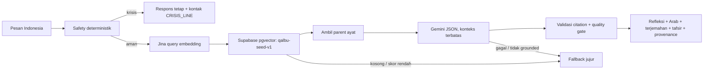

# Qalbu MVP

Qalbu adalah chat refleksi Al-Qur'an berbahasa Indonesia. User menulis kondisi emosional;
sistem menjalankan safety check deterministik, mencari ayat relevan dari satu corpus Indonesia,
lalu Gemini menyusun refleksi singkat berdasarkan sumber tersebut.

Qalbu bukan diagnosis, terapi, fatwa, atau pengganti manusia tepercaya dan tenaga profesional.

## Jalur runtime



Runtime sengaja hanya punya satu bahasa, satu corpus, satu embedding provider (Jina), dan satu
LLM provider (Gemini). Vector search memakai child chunks yang sudah ada di Supabase untuk
menemukan parent ayat; tidak ada reranker atau routing corpus kedua. Riwayat chat disimpan lokal
di browser untuk fitur New Chat; server tidak menyimpan percakapan. Cache tetap process-local dan TTL.

## Jalankan lokal

Syarat: Python 3.11+, corpus `qalbu-seed-v1` sudah terisi di Supabase, dan credential provider.

```powershell
python -m venv .venv
.\.venv\Scripts\Activate.ps1
pip install -r requirements.txt
Copy-Item .env.example .env
python -m uvicorn app.main:app --host 127.0.0.1 --port 8000
```

Buka [http://127.0.0.1:8000/](http://127.0.0.1:8000/).

Jika muncul `Failed to fetch`, cek [http://127.0.0.1:8000/api/health](http://127.0.0.1:8000/api/health)
dan pastikan proses Uvicorn masih berjalan di port 8000.

Docker:

```powershell
docker compose up --build
```

## Environment MVP

Isi hanya di `.env` atau secret manager:

| Variabel | Fungsi |
|---|---|
| `GEMINI_API_KEY`, `GEMINI_MODEL` | Refleksi grounded |
| `JINA_API_KEY`, `JINA_EMBEDDING_MODEL` | Query embedding |
| `SUPABASE_URL`, `SUPABASE_SECRET_KEY` | Server-side vector/database access |
| `MIN_RETRIEVAL_SCORE`, `TOP_K_RETRIEVAL`, `RETRIEVAL_PARENT_K` | Batas retrieval |
| `CRISIS_LINE`, `CRISIS_LINE_LABEL` | Kontak bantuan terverifikasi |

Secret Supabase tidak boleh dikirim ke browser atau di-commit. `SUPABASE_SERVICE_ROLE_KEY`
masih diterima sebagai kompatibilitas lama.

## Endpoint

- `GET /api/health` — health/config status.
- `POST /api/v1/chat` — SSE berisi `response`, `crisis`, `error`, lalu `done`.

Payload chat minimum:

```json
{"message":"Aku merasa hampa"}
```

Tidak ada endpoint auth, history, feedback, export, evaluation, English corpus, atau scraper
di jalur MVP. History hanya fitur frontend berbasis `localStorage`, bukan persistence server.

## Data dan provenance

Runtime membaca `qalbu-seed-v1` dari tabel Supabase `quran_documents` dan `quran_chunks`.
Response hanya menampilkan teks yang berasal dari row retrieved; LLM tidak membuat teks Arab,
terjemahan, nomor ayat, atau sitasi. Jika source/context gagal atau tidak cukup relevan, UI
menampilkan fallback jujur. Jika source ditandai komunitas, label nonresmi tetap ditampilkan.

Migration Supabase di `supabase/migrations/` dipertahankan, termasuk schema parent/chunk dan
RPC vector search yang sudah dipakai corpus aktif.

## Verifikasi

```powershell
python -m pytest -q
python -m ruff check app tests
python -m mypy app
```

Test fokus pada safety, retrieval threshold/dedup, citation/provenance, fallback, structured
Gemini output, API SSE, dan konfigurasi minimum.

## Batasan MVP

- Coverage/relevansi bergantung pada isi dan embedding corpus `qalbu-seed-v1`.
- Tidak ada dashboard evaluasi otomatis; review ayat/tafsir dilakukan manual.
- Kontak krisis harus diverifikasi sebelum deployment publik.
- Latency bergantung pada Jina, Supabase, dan Gemini.
