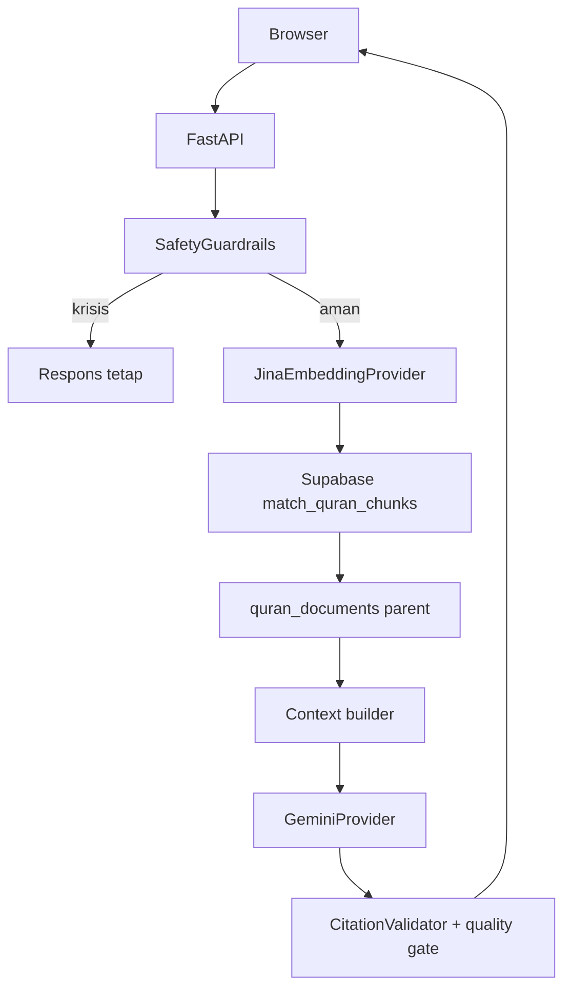

# Arsitektur MVP

Satu jalur chat memakai corpus `qalbu-seed-v1`. Child chunk hanya indeks vector; parent menyimpan
Arab, terjemahan, tafsir, tema, dan provenance. Tidak ada English route, reranker, scraper,
feedback, history, atau persistence percakapan di runtime.
