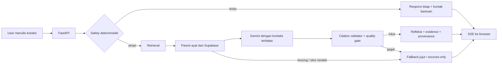
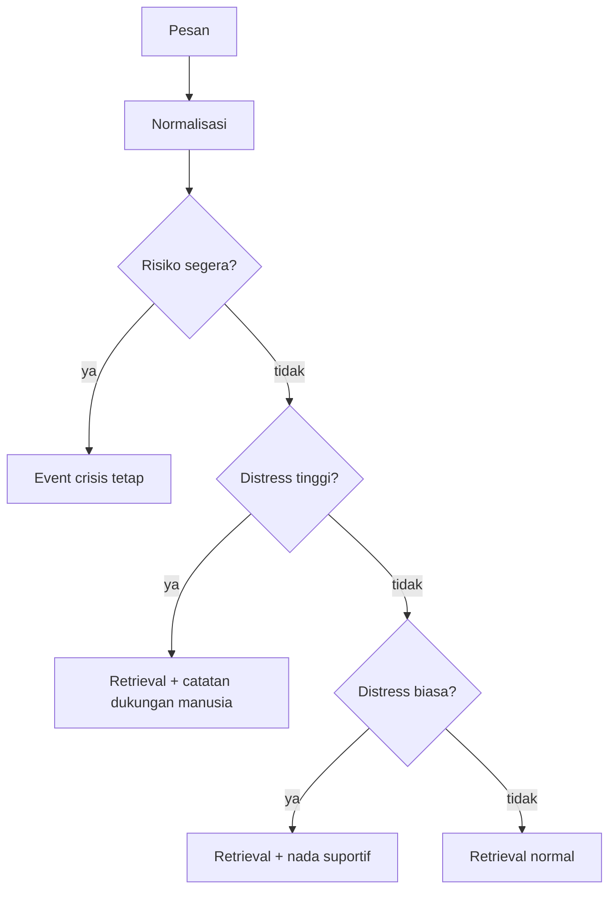
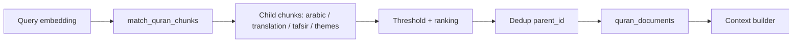
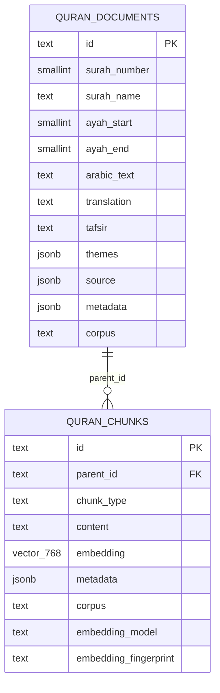
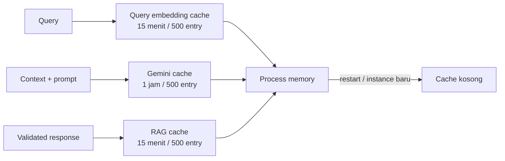

# Arsitektur Qalbu MVP

Dokumen ini menjelaskan jalur yang benar-benar dipakai aplikasi Qalbu saat ini. Fokusnya satu:
pesan emosional berbahasa Indonesia → ayat relevan → refleksi singkat yang tetap terlacak ke
sumber.

Qalbu bukan alat diagnosis, terapi, fatwa, layanan krisis, atau pengganti manusia tepercaya dan
tenaga profesional.

## 1. Mental model



Komponen aktif hanya satu jalur MVP:

| Bagian | Implementasi | Tugas |
|---|---|---|
| UI | `frontend/index.html` | Chat satu halaman, SSE reader, ayat/evidence, riwayat lokal |
| HTTP | `app/main.py`, `app/api/routes/chat.py` | Static files, CORS, rate limit, timeout, endpoint chat |
| Safety | `app/safety/guardrails.py` | Deteksi deterministik sebelum network call |
| Query | `app/rag/query_processing.py` | Normalisasi dan tema retrieval, bukan diagnosis |
| Embedding | `app/providers/embeddings/jina.py` | Query embedding dengan task `retrieval.query` |
| Vector DB | Supabase pgvector + `match_quran_chunks` | Cari child chunk corpus aktif |
| Parent store | `app/database/queries.py` | Ambil dokumen ayat lengkap dari `quran_documents` |
| LLM | `app/providers/llm/gemini.py` | Buat JSON refleksi berdasarkan konteks retrieval |
| Guard output | `app/rag/citation_validator.py`, `response_quality.py` | Buang sitasi palsu, cek relevansi, tafsir, nada, panjang |

## 2. Jalur request dari awal sampai akhir

### 2.1 Browser mengirim pesan

1. User menulis maksimal 500 karakter di `frontend/index.html`.
2. Browser mengirim `POST /api/v1/chat`:

   ```json
   {"message":"Aku merasa hampa"}
   ```

3. Browser membaca response sebagai Server-Sent Events (SSE), bukan JSON tunggal.
4. UI hanya merender event final `response`, `crisis`, atau `error`. Kandidat retrieval mentah
   tidak pernah dikirim ke UI.

### 2.2 FastAPI membuat batas request

`app/api/routes/chat.py` melakukan tiga hal sebelum pipeline:

- validasi Pydantic: `message` wajib 1–500 karakter;
- fixed-window rate limit berbasis IP, default 10 request/menit per proses;
- timeout request, default 30 detik, lalu event `error` dan `done` jika terlampaui.

Setiap request mendapat `request_id` untuk log dan payload `done`.

### 2.3 Safety berjalan sebelum embedding dan LLM

`SafetyGuardrails` tidak melakukan network call. Pesan dinormalisasi (case-fold, typo/slang,
leetspeak, spasi), lalu diperiksa berurutan:



- `IMMEDIATE_DANGER`: respons tetap; pesan tidak dikirim ke Jina atau Gemini.
- `HIGH_DISTRESS`: retrieval boleh jalan, tetapi respons mendapat anjuran menghubungi orang
  tepercaya/tenaga profesional bila keadaan makin berat.
- `DISTRESS`: retrieval normal dengan nada nonmenghakimi.
- `NORMAL`: alur biasa.

Safety check bukan penilaian klinis. Pattern hanya guardrail MVP dan dapat memiliki false positive
atau false negative.

### 2.4 Query dipersempit ke ruang refleksi

`app/rag/query_processing.py` mencocokkan kata/tema dari `app/quran/themes.py`, lalu menambahkan
hint retrieval seperti konsep kesedihan, kecemasan, beban, atau makna hidup. Ini hanya membantu
pencarian; sistem tidak menyimpulkan diagnosis.

Pertanyaan yang jelas-jelas bukan refleksi (misalnya harga kripto, cuaca, atau kode Python) ditolak
dengan respons di luar ruang Qalbu sebelum embedding.

### 2.5 Embedding query

`JinaEmbeddingProvider` mengirim satu query ke endpoint Jina:

```text
POST https://api.jina.ai/v1/embeddings
model      = JINA_EMBEDDING_MODEL
task       = retrieval.query
dimensions = 768
normalized = true
```

Embedding query disimpan di cache in-memory 15 menit. Cache memakai hash model, dimensi, dan teks;
tidak menyimpan prompt ke disk.

Embedding **dokumen** bukan pekerjaan runtime chat. Dokumen harus sudah di-embed saat indexing dan
vector-nya sudah ada di Supabase sebelum aplikasi dipakai.

### 2.6 Vector search dan parent lookup

`QuranRetriever` menjalankan:

1. Jina query embedding.
2. RPC Supabase `match_quran_chunks(embedding, match_count, corpus_filter)` pada corpus
   `qalbu-seed-v1`.
3. Buang result dengan skor cosine di bawah `MIN_RETRIEVAL_SCORE` (default `0.32`).
4. Deduplicate berdasarkan `parent_id`; child terkuat mewakili satu parent.
5. Batasi parent ke `RETRIEVAL_PARENT_K` (default `4`).
6. Ambil row lengkap dari `quran_documents`.
7. Buang dokumen yang memiliki metadata `accusatory=true`.



Skor dihitung PostgreSQL sebagai `1 - (embedding <=> query_embedding)`. HNSW index dipakai untuk
cosine search. RPC membatasi jumlah result agar input tidak membesar tanpa batas.

Jika tidak ada parent setelah threshold/filter, pipeline berhenti dengan fallback relevansi jujur.
Tidak ada ayat yang dibuat oleh model.

### 2.7 Context builder

`app/rag/context_builder.py` membentuk blok terstruktur:

```text
<retrieved_context>
SOURCE 1
PARENT_ID: ...
Surah: ...
Ayah: ...
Arabic: [rendered separately by the UI; do not quote or reproduce]
Translation (...): ...
Tafsir (...): ...
Themes: ...
Source status: ...
</retrieved_context>
```

Budget default `MAX_CONTEXT_TOKENS=1800`. Translation dan tafsir dipotong per parent agar context
tetap bounded. Arab sengaja tidak diberikan sebagai teks yang harus ditulis ulang Gemini; UI
menampilkan Arab langsung dari `evidence` sumber.

### 2.8 Gemini menghasilkan refleksi terstruktur

`GeminiProvider` mengirim system prompt Qalbu, query user, context retrieval, dan JSON schema
`answer`, `references[parent_id]`, `safety_note`. Temperature `0.2`; natural-language answer
dibatasi sekitar 72 token. Provider retry maksimal tiga kali dengan backoff eksponensial.

Aturan prompt penting:

- hanya gunakan konteks retrieval;
- jangan membuat Arab, terjemahan, tafsir, nomor ayat, atau sitasi;
- akui emosi yang benar-benar disebut user;
- kaitkan SOURCE 1;
- bila tafsir ada, awali atribusi dengan `Dalam tafsir yang tersedia,`;
- jangan mendiagnosis, menggurui, menjanjikan kesembuhan, atau menyebut Qalbu sebagai satu-satunya
  bantuan.

Response Gemini dicache in-memory 1 jam berdasarkan model, query, context, dan token budget.

### 2.9 Validasi sitasi dan kualitas

`CitationValidator` adalah batas kepercayaan utama:

1. Hanya `parent_id` yang benar-benar ada di hasil retrieval yang boleh dipakai.
2. Field surah/ayat yang kosong dilengkapi dari parent retrieved.
3. Field yang bertentangan dengan parent membuat sitasi dibuang.
4. Evidence (Arab, translation, tafsir, status sumber) disalin dari row Supabase, bukan dari LLM.
5. Metadata komunitas menambahkan peringatan provenance.

`assess_contextual_response` menolak draft jika tidak mengakui konteks user, tidak mencantumkan
parent utama, tidak mengatribusikan tafsir, membuat janji hasil, menyisipkan Arab/kutipan/nama
surah/nomor ayat/wording Inggris, atau melebihi budget.

Jika gagal, Gemini mendapat satu repair prompt. Jika percobaan kedua tetap gagal, UI menerima
`sources-only response`: teks singkat bahwa refleksi AI tidak tersedia, tetapi evidence sumber tetap
ditampilkan.

### 2.10 Event SSE ke browser

Event normal:

```text
event: response
data: {"answer":"...","references":[...],"evidence":[...]}

event: done
data: {"timings":{...},"profile":"...","request_id":"..."}
```

Event krisis hanya berisi respons tetap dan label/kontak yang dikonfigurasi. Event error tidak
membocorkan exception provider ke user.

## 3. Data dan parent-child chunking

### 3.1 Sumber data

Folder `data/external/indonesian-quran/` menyimpan snapshot Indonesia sebagai artefak referensi.
Runtime **tidak** membaca JSON itu langsung. Runtime membaca corpus `qalbu-seed-v1` dari Supabase.

Provenance snapshot saat ini ditandai `unverified`; jangan menyebutnya terjemahan resmi Kemenag
sebelum metadata sumber diverifikasi.

### 3.2 Bentuk tabel



**Parent** = satu unit ayat/rentang ayat lengkap yang dikembalikan ke UI. Isinya Arab,
terjemahan, tafsir, tema, dan provenance.

**Child** = unit kecil yang di-embed untuk pencarian. `chunk_type` aktif: `arabic`, `translation`,
`tafsir`, `themes`. Child menunjuk ke parent lewat `parent_id`; child tidak ditampilkan sebagai
jawaban akhir.

### 3.3 Workflow indexing satu kali

```mermaid
flowchart TD
    FILE[Snapshot/source Quran] --> N[Normalisasi metadata]
    N --> P[Upsert quran_documents parent]
    P --> C[Split child per field]
    C --> E[Jina task retrieval.passage]
    E --> F[Fingerprint model + dimensi + content]
    F --> V[Insert quran_chunks vector(768)]
    V --> I[HNSW cosine index + RPC]
    I --> READY[Corpus qalbu-seed-v1 siap dipakai]
```

Indexing harus memakai model/dimensi yang sama dengan runtime. Jika model atau dimensi berubah,
semua child vector harus di-embed ulang dan schema/RPC harus dimigrasikan bersama. Migration
embedding manifest membantu mendeteksi vector lama.

Repo menyimpan migration schema/index/RPC, tetapi tidak menjalankan indexing otomatis saat server
boot. Startup chat tidak mengulang embedding atau mengubah database.

### 3.4 Urutan migration penting

Migration di `supabase/migrations/` membangun schema secara bertahap:

1. tabel parent/child dan vector column;
2. corpus partition `qalbu-seed-v1` + filter RPC;
3. HNSW index dan tuning `ef_search`;
4. manifest provider/model/dimensi/fingerprint;
5. revoke akses publik ke RPC dan tabel, hanya `service_role`.

Migration lama jangan dihapus meskipun fitur yang dibuatnya tidak dipanggil langsung. Database
production mungkin sudah pernah menjalankannya.

## 4. Cache, privacy, dan batas proses



- Cache process-local, TTL, LRU; tidak persisten ke disk.
- Riwayat chat hanya `localStorage` browser untuk fitur Chat Baru; server tidak menyimpan
  percakapan.
- Secret Gemini, Jina, dan Supabase hanya dibaca backend dari environment.
- Rate limiter juga process-local. Jika nanti multi-instance, gunakan shared rate limiter/store.
- Free host dapat sleep; cold start dan latency provider eksternal adalah normal.

## 5. Fallback dan failure matrix

| Kondisi | Yang dilakukan | Yang tidak dilakukan |
|---|---|---|
| Risiko krisis | Respons tetap + kontak terkonfigurasi | Tidak memanggil Gemini/Jina |
| Query out-of-scope | Pesan di luar ruang refleksi | Tidak melakukan retrieval |
| Tidak ada parent / skor rendah | Fallback relevansi jujur | Tidak mengarang ayat |
| Terjemahan komunitas belum ada | Tampilkan sumber tanpa refleksi buatan | Tidak menerjemahkan dengan LLM |
| Jina/Supabase gagal | Error/fallback sources-only | Tidak membocorkan exception |
| Gemini gagal | Tampilkan evidence sumber | Tidak mengarang refleksi |
| Sitasi tidak valid | Buang sitasi dan retry/fallback | Tidak meneruskan parent palsu |
| Quality gate gagal dua kali | Sources-only response | Tidak memaksa output generik |
| Rate limit | HTTP 429 | Tidak memproses request |

## 6. File map untuk membaca kode

Mulai dari sini jika ingin memahami project tanpa membaca semua file:

1. `app/main.py` — bootstrap FastAPI dan static frontend.
2. `app/api/routes/chat.py` — kontrak HTTP/SSE.
3. `app/api/dependencies.py` — wiring provider dan corpus aktif.
4. `app/rag/pipeline.py` — orkestrator safety → retrieval → generation → fallback.
5. `app/rag/retriever.py` — embedding, threshold, dedup parent.
6. `app/database/queries.py` — RPC vector search dan parent lookup.
7. `app/providers/embeddings/jina.py` — adapter embedding + cache query.
8. `app/providers/llm/gemini.py` — adapter Gemini + JSON schema + cache.
9. `app/rag/citation_validator.py` — provenance/evidence dari sumber.
10. `app/rag/response_quality.py` — quality gate dan repair prompt.
11. `app/safety/guardrails.py` — safety gate deterministik.
12. `frontend/index.html` — UI, SSE parser, evidence renderer, local history.
13. `supabase/migrations/` — schema, RPC, index, dan akses database.
14. `tests/` — kontrak safety, retrieval, citation, provider, API, dan UI history.

## 7. Cara menjalankan dan memverifikasi

```powershell
python -m venv .venv
.\.venv\Scripts\Activate.ps1
pip install -r requirements.txt
Copy-Item .env.example .env
python -m uvicorn app.main:app --host 127.0.0.1 --port 8000
```

Buka `http://127.0.0.1:8000/`, lalu cek:

```powershell
Invoke-WebRequest http://127.0.0.1:8000/api/health
```

Verifikasi kode:

```powershell
python -m pytest -q
python -m ruff check app tests
python -m mypy app
```

Health `status=ok` hanya berarti proses hidup. Status `rag=configured` berarti tiga dependency
server-side (Gemini, Jina, Supabase) terbaca; itu belum membuktikan corpus berisi data.

## 8. Audit arsitektur: nilai, biaya, dampak

### Nilai

Jalur pendek ini cukup untuk MVP portfolio: satu bahasa, satu corpus, satu embedding provider, satu
LLM provider, evidence yang bisa diaudit, dan fallback yang jujur. Guardrail paling penting berada
sebelum provider eksternal dan sitasi tidak dipercayakan kepada model.

### Biaya yang sengaja diterima

- Cache dan rate limit hanya berlaku dalam satu proses.
- Indexing corpus dilakukan di luar startup.
- Tidak ada auth, history server, dashboard evaluasi, reranker, atau multi-provider.
- Retrieval memakai heuristic tema sederhana dan threshold statis.

Menambah komponen itu baru bernilai jika metrik nyata menunjukkan masalah: corpus lebih besar,
multi-instance, kebutuhan audit, atau evaluasi relevansi yang terukur.

### Dampak dan batasan yang harus diketahui

- Kualitas jawaban dibatasi kualitas/coverage corpus `qalbu-seed-v1` dan metadata provenance.
- Snapshot Indonesia saat ini belum otomatis berarti resmi Kemenag.
- Kontak krisis harus diisi dan diverifikasi sebelum deployment publik.
- Provider eksternal menentukan latency dan availability.
- History lokal dapat hilang saat data situs dibersihkan dan tidak cocok untuk perangkat bersama.

### Keputusan pemeliharaan

Jangan menghapus migration lama hanya karena bukan jalur chat aktif. Jangan menambah abstraction
provider, reranker, atau database history tanpa kebutuhan terukur. Untuk perubahan berikutnya, mulai
dari test yang gagal atau metrik yang menunjukkan batasan di atas.
