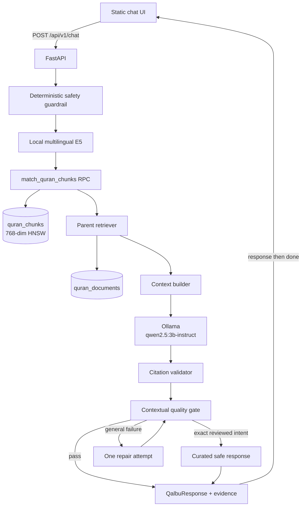
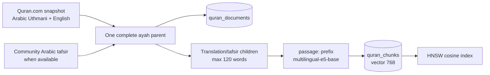

# Arsitektur RAG Qalbu

## Tujuan dan boundary

Qalbu menghasilkan refleksi singkat berbasis evidence Quran yang berhasil di-retrieve. Sistem bukan penerjemah resmi, layanan terapi, mesin fatwa, atau otoritas agama. Teks Arab, translation, tafsir, dan metadata sumber disimpan sebagai data kanonis; model hanya menyusun bagian refleksi.

## Komponen



## Offline: source menjadi index



Pipeline:

1. `scripts/fetch_quran_com.py` membuat snapshot lokal dan menolak hasil yang bukan tepat 6.236 ayat.
2. Provider menggabungkan Arabic, attributed English translation, tafsir yang tersedia, dan provenance menjadi satu `QuranDocument` per ayat.
3. `scripts/seed.py` meng-upsert parent ke `quran_documents`.
4. `scripts/chunk.py` membagi field searchable—translation dan tafsir—menjadi child maksimal 120 kata. Arabic kanonis tetap pada parent agar tidak terpotong/diubah.
5. `scripts/embed.py` meng-encode `passage: <content>`, normalisasi vector, lalu upsert per batch ke `quran_chunks`.
6. Fingerprint mengikat child pada text, model, dan dimensi. Run lanjutan hanya meng-embed child baru/berubah.
7. `scripts/reconcile_chunks.py` menghapus child retired hanya setelah semua child aktif ditemukan di database.

Model embedding dan dimensi tidak boleh diganti sebagian. Perubahan dimensi mengharuskan migrasi kolom pgvector, index HNSW, RPC, serta full re-index dalam satu release.

## Online: pesan menjadi jawaban

1. FastAPI memvalidasi request dan rate limit per IP.
2. `SafetyGuardrails` berjalan sebelum akses database/LLM.
3. Bahaya segera menghasilkan event `crisis` lalu `done`; RAG dilewati.
4. Query dinormalisasi dan di-encode sebagai `query: <message>`. Query yang sama dapat memakai cache embedding process-local.
5. RPC `match_quran_chunks` mengambil child kandidat (`candidate_k=12` default).
6. Retriever menerapkan score minimum (`0.55`), memilih child terkuat per parent, dan membatasi parent (`2` default).
7. Exact intent yang telah direview dapat memakai curated parent mapping; intent lain memakai vector result.
8. Parent berlabel `accusatory` dibuang sebelum context dibangun.
9. Context hanya membawa identifier, attributed translation, tafsir/summary yang tersedia, dan provenance. Arabic exact tidak perlu diberikan ke model untuk dikutip ulang.
10. Qwen menghasilkan JSON `answer + references`.
11. `CitationValidator` menolak parent ID yang tidak termasuk retrieved set dan mengisi field surah/ayah/evidence dari parent kanonis.
12. Quality gate mengecek relevansi terhadap keadaan pengguna, dukungan tafsir, unsupported claim, quote leakage, dan panjang.
13. Jika gagal, exact reviewed intent boleh memakai curated safe response. Selain itu model mendapat satu repair attempt; kegagalan berikutnya fail-closed.
14. UI menerima satu event `response` final berisi answer + evidence, lalu `done` dengan timings/request ID.

Tidak ada event candidate `verses` atau draft `token`. Dengan begitu UI tidak pernah menampilkan retrieval mentah atau output model sebelum validasi selesai.

## Kontrak grounding

1. Reference hanya sah bila `parent_id` ada di parent yang benar-benar di-retrieve.
2. Surah, ayah, Arabic, translation, tafsir, status sumber, tema, dan score final diisi dari database—bukan dipercaya dari model.
3. Model tidak diberi izin membuat terjemahan Indonesia seolah resmi.
4. Tafsir komunitas selalu dilabeli non-Kemenag/unverified.
5. Refleksi harus menghubungkan keadaan pengguna dengan makna evidence; menyalin kartu ayat saja tidak cukup.
6. Bila context tidak cukup atau quality gate gagal, sistem mengaku tidak mampu alih-alih mengarang.

## Cache dan lifecycle

| Cache | Key konseptual | TTL | Catatan |
| --- | --- | --- | --- |
| Query embedding | Normalized query | 15 menit | Menghindari encode E5 berulang |
| LLM response | Model + query + context | 60 menit | Hanya data process-local |
| Legacy RAG response | Cache version + query | 15 menit | Dipakai endpoint JSON lama |

Cache hilang saat proses restart. Setelah corpus/prompt berubah, bump `RAG_CACHE_VERSION` dan restart service. `OLLAMA_KEEP_ALIVE=5m` mempertahankan model sebentar agar percakapan berikutnya tidak selalu cold-load; turunkan bila Windows mulai paging.

## Storage schema konseptual

```text
quran_documents
  id                  stable provider-specific parent ID
  surah/ayah          canonical reference
  arabic_text         exact source text
  translation         attributed English, when available
  tafsir              source tafsir, when available
  themes/metadata     retrieval labels + provenance

quran_chunks
  id                  deterministic child ID
  parent_id           FK-like mapping to quran_documents
  content/type        searchable translation or tafsir text
  embedding           vector(768)
  embedding_model     model identity
  embedding_fingerprint source/model manifest
```

## Failure map

| Gejala | Layer paling mungkin | Pemeriksaan awal |
| --- | --- | --- |
| `Failed to fetch` | Origin/server | Buka `http://127.0.0.1:8000`; cek `/api/v1/health` |
| `RAG_UNAVAILABLE` | Config/Supabase | URL + server-side key + migration RPC |
| Tidak ada evidence | Retrieval/index | Score, row vector aktif, parent mapping, provider data |
| `generator_down` | Ollama | `ollama list`, base URL, RAM, service Ollama |
| `validation_failed` | LLM/quality gate | Log issue contextual, citation, tafsir, quote, length |
| `/ready` false | Release gate | Isi hanya kontak krisis yang benar-benar diverifikasi |
| Lambat request pertama | Cold model | E5/Qwen load; bandingkan latency request berikutnya |

## Future Kemenag path

1. Tambah provider baru di `app/quran/providers/`; jangan overwrite record Quran.com/community.
2. Simpan provenance, status official, versi, attribution, dan izin penggunaan secara eksplisit.
3. Jalankan seed → chunk → embed → reconcile.
4. Bump cache version dan restart API.
5. Jalankan retrieval/generation evaluation serta review konten sebelum deploy.
