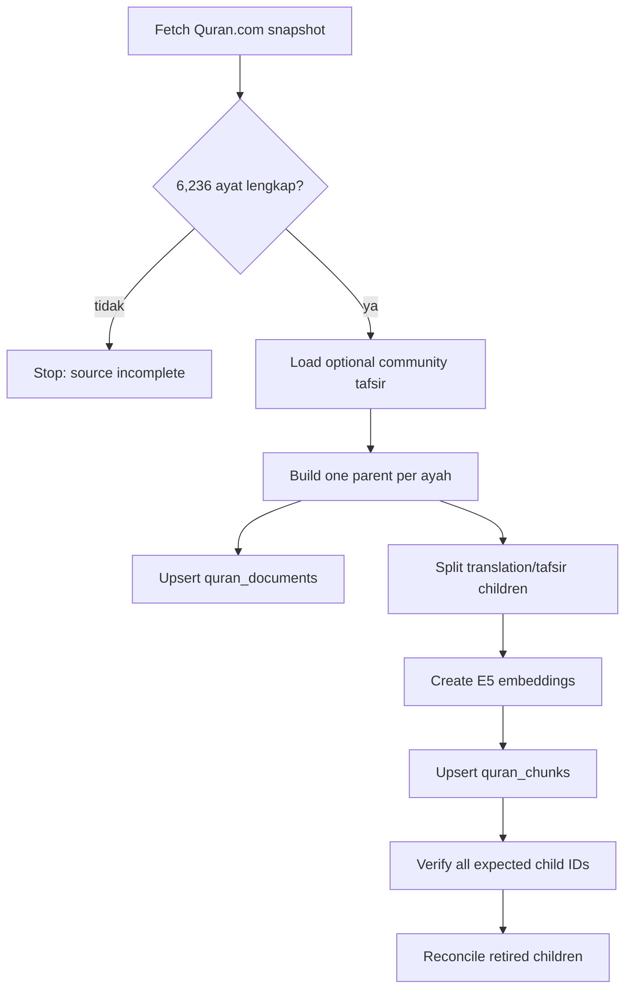
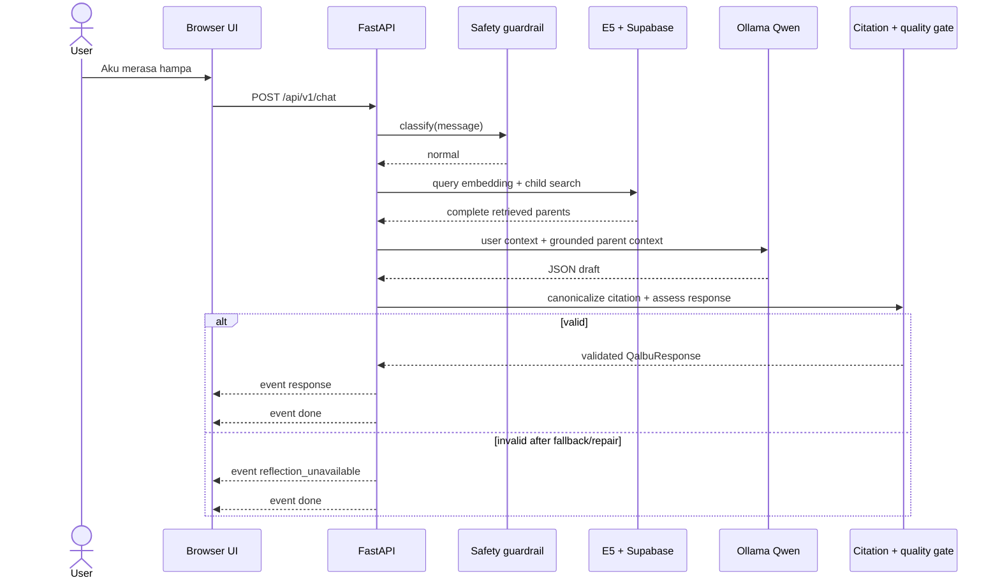

# Workflow Qalbu dari awal sampai akhir

Dokumen ini menunjukkan letak data, model, validator, dan titik kegagalan agar debugging tidak menebak-nebak.

## 1. Persiapan corpus



Perintah:

```powershell
python scripts/fetch_quran_com.py
python scripts/seed.py
python scripts/chunk.py
python scripts/embed.py
python scripts/reconcile_chunks.py
```

Output penting:

- Parent lengkap berada di Supabase `quran_documents`.
- Manifest child lokal berada di `data/temporary/chunks.json` dan tidak masuk Git.
- Vector child berada di `quran_chunks`.
- Corpus eksternal di `data/external/` tidak masuk Git; lihat `data/README.md`.

## 2. Request chat normal



UI mempertahankan skeleton sampai event final. Candidate verse dan token draft tidak di-stream agar evidence yang gagal validasi tidak sempat terlihat.

## 3. Request berisiko bahaya segera

```text
message
  → deterministic safety normalization/classification
  → IMMEDIATE_DANGER
  → crisis event + verified contact when configured
  → done
  → no vector search
  → no LLM generation
```

Jangan mengisi `CRISIS_LINE` dengan nomor tebakan. `/api/v1/ready` sengaja gagal sampai kontak benar-benar diverifikasi.

## 4. Retrieval dan grounding

```text
user text
  → normalize
  → cache lookup
  → E5 encode("query: ...")
  → match_quran_chunks(candidate_k=12)
  → score >= 0.55
  → strongest child per parent
  → exact reviewed intent mapping OR vector parents
  → remove accusatory parents
  → take up to RETRIEVAL_PARENT_K (default 2)
  → build bounded model context
```

Setelah model menjawab:

```text
draft reference IDs
  → intersect with actually retrieved parent IDs
  → fill canonical surah/ayah/evidence from database
  → reject unsupported citations
  → assess contextual relevance + tafsir support + unsupported claims
  → pass / curated safe fallback / one repair / fail closed
```

## 5. SSE contract

| Jalur | Event berurutan |
| --- | --- |
| Jawaban valid | `response` → `done` |
| Tidak ada context cukup | `response` (honest fallback) → `done` |
| Bahaya segera | `crisis` → `done` |
| Generator mati | `reflection_unavailable(reason=generator_down)` → `done` |
| Quality/citation gagal | `reflection_unavailable(reason=validation_failed)` → `done` |
| Exception route | `error` → `done` |

`done` membawa `request_id`, profile, dan timing total/retrieval/generation bila tersedia.

## 6. Cache

- Semua cache saat ini berada di RAM proses dan hilang ketika restart.
- Safety crisis dan failure tidak disimpan sebagai respons sukses.
- Query cache mencegah embedding ulang query yang sama.
- LLM cache mengikat model, query, dan context; perubahan context menghasilkan key lain.
- Legacy response cache memasukkan `RAG_CACHE_VERSION`.
- Setelah source/prompt/routing berubah: bump cache version dan restart.

## 7. Debug dari luar ke dalam

```powershell
curl.exe http://127.0.0.1:8000/api/v1/health
curl.exe http://127.0.0.1:8000/api/v1/ready
curl.exe http://127.0.0.1:8000/api/v1/sources
curl.exe http://127.0.0.1:8000/api/v1/config/public
ollama list
```

Urutan diagnosis:

1. Browser harus membuka port FastAPI, bukan file statis/Live Server.
2. `/health` harus menyatakan RAG configured.
3. `/sources` menunjukkan snapshot yang tersedia, tetapi ini belum membuktikan vector DB lengkap.
4. Periksa row/fingerprint vector aktif di Supabase setelah embedding.
5. Uji Ollama langsung bila generation gagal.
6. Cari `request_id` yang sama di log untuk membedakan retrieval, model, citation, dan quality failure.
7. Jalankan test suite sebelum mengubah threshold atau prompt.

## 8. Release workflow

```text
source/license review
  → full ingestion + DB count verification
  → retrieval evaluation
  → grounded generation evaluation
  → Islamic-content review
  → mental-health/crisis review
  → accessibility + load test
  → secret scan
  → production image/config
  → deploy + observe
```

Docker Compose di repository adalah lingkungan development dengan bind mount dan reload. Jangan mempromosikannya langsung sebagai produksi.
